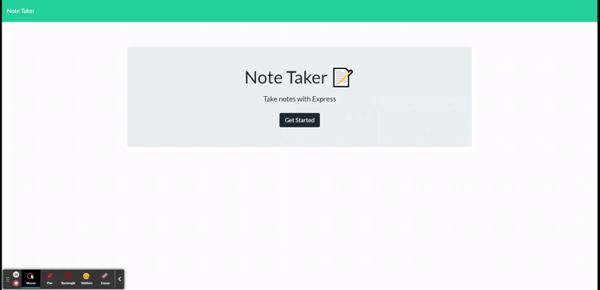

# Note Taker
  

  ## Table of Contents
  - [Description](#description)
  - [Installation Instructions](#installation-instructions)
  - [Contribution Instructions](#contribution-instructions)
  - [Testing Instructions](#testing-instructions)
  - [License](#license)
  - [Questions](#questions)
  ## Description
  A web-based note taking application with a Node/Express backend.

  ## Installation Instructions
  Install Node js first, then clone or fork the repository

  Run an npm install then run the server.js file using Node

  Or to use the deployed version, look [here](https://pacific-island-82773.herokuapp.com/)

  ## Usage Instructions.
  On the landing page, click the Get Started button to go to the notes page.

  Click the plus on the top right corner to add a note.
  Once you've finished creating your note, click the save icon.
  To view a note, click on the note title on the left sidebar.
  To remove a note, click the trashcan icon associated with the note title. 

  Here's an example:
  

  ## Contribution Instructions
  It's finished. Please don't contribute, just enjoy.

  ## Testing Instructions
  No tests necessary.

  ## License
  [MIT](https://opensource.org/licenses/MIT)
  
  ## Questions
  Check out my [Github](https://github.com/SlaterMcArdle)

  Or [email me](mailto:slater.mcardle@outlook.com)
